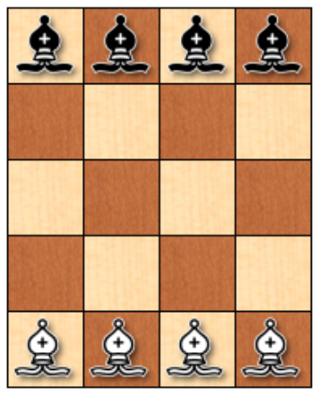

# 3 Introducción a la Inteligencia Artificial: Introspección

El problema que se presenta es mover 8 alfiles presentes en un tablero reducido de ajedrez. El objetivo del problema o juego es que los 8 alfiles intercambien posición, con las limitantes de que se deben respetar los movimientos que puede realizar un alfil según las reglas del ajedrez. Otra regla añadida es que en ningún momento se deben atacar los alfiles, se considera un ataque cuando una pieza esta al alcance del alfil en el siguiente movimiento.

Para resolver este problema lo primero es comprender las reglas de movimiento del alfil en el ajedrez. Un alfil solo puede moverse de manera diagonal a casillas del mismo color que en la que esta colocado, por ende no puede empezar sobre una casilla clara y terminar en una casilla oscura. El movimiento que realiza el alfil no tiene límites mínimos ni máximos de casillas a alcanzar, es decir, depende de el jugador decidir la cantidad de casillas que recorrerá el alfil, siempre y cuando se respete que solo se permiten líneas rectas. Los movimientos del alfil pueden ser hacia cualquier dirección, no hay limitante si se desea retroceder o avanzar.

Con esta regla definida procede a analizarse el acomodo del tablero reducido, es un tablero de 4 casillas de base y 5 casillas de altura, lo que da el espacio justo para que los alfiles tengan movimientos disponibles en los que no se produzca ninguna jugada de ataque. Si el tablero fuera mucho más grande y se tuviera el mismo número de alfiles sería mucho más sencillo. Y si fuera más pequeño, no sería posible llevar a cabo el juego pues desde el inicio ya habría alfiles atacandose.

Para resolver este acertijo hay que hacer dos observaciones importantes, la primera es que se pueden hacer movimientos “copia”, es decir, hacer el movimiento equivalente en cuestión de perspectiva del jugador. Si el jugador de los alfiles blancos mueve una pieza una casilla hacía arriba a la derecha, el jugador de los alfiles negros puede mover el alfil equivalente en posición hacía abajo a la izquierda. Más que una copia del movimiento es un movimiento simétrico, pues hay algunas diferencias a considerar, por ejemplo al ser un movimiento simétrico, no es el alfil de enfrente el que se mueve, debido al tamaño y distribución del tablero, los alfiles que se mueven no coinciden en el color de la casilla base. Si el alfil blanco estaba en una casilla negra, el alfil negro que se moverá estará en una casilla blanca.

El segundo punto importante a tener en cuenta es que hay alfiles que nunca se van a encontrar o atacar, por más que se coloquen uno frente a otro. Esta obsevación aplica para los alfiles en casilla blanca versus los alfiles en casilla negra, sin importar el color de la pieza.  Este hecho permite que se realicen ciertas jugadas que facilitan el intercambio de los alfiles sin romper la regla del ataque. Además de que el aprovechamiento de este hecho facilita las jugadas copia o simétricas mencionadas anteriormente.

El tercer punto a considerar es que hay algunas casillas a las que se pueden mover los alfiles sin atacar a otros. Estas cambian en cantidad y número dependiendo de las posiciones de los alfiles en el tablero. A través de estas casillas es que se pueden realizar los movimientos de los alfiles sin romper ninguna de las reglas básicas para completar el juego. Combinando el uso de este factor, junto con las jugadas simétricas y los alfiles que nunca se podrán atacar, es posible hacer varios movimientos para solucionar este acertijo.
Para simplificar la explicación de utilizará el sistema de coordenadas ya existende del tablero de ajedrez. Lo que resultaría en un acomodo como el siguiente.

|#|1|2|3|4|
|---|---|---|---|---|
|A|♟️|♟️|♟️|♟️|
|B|___|___|___|___|
|C|___|___|___|___|
|D|___|___|___|___|
|E|👑|👑|👑|👑|

En este caso, los peones serán la representación de los alfiles negros, mientras que las coronas la representación de los alfiles blancos.

Utilizando los hechos estratégicos mencionados anteriormente, aclararemos que todos los movimientos a realizarse serán simétricos. Por otro lado, podemos observar que en este caso las casillas seguras son 2D y 3D para las piezas blancas y 2B y 3B para las piezas negras, podemos colocar los distintos alfiles en esas casillas para comprobar los posibles resultados. Si se colocan los alfiles de las orillas, en el siguiente turno no podremos hacer movimietnos donde no se rompa la regla del ataque, por lo que lo ideal es mover un alfil del centro. Por lo que el alfil en 2E se moverá a 3D y el alfil en 3A, se moverá a 2B. Resultando en el tablero siguiente.

|#|1|2|3|4|
|---|---|---|---|---|
|A|♟️|♟️|___|♟️|
|B|___|♟️|___|___|
|C|___|___|___|___|
|D|___|___|👑|___|
|E|👑|___|👑|👑|

Para este turno podemos observar que hay incluso algunas piezas que no podremos mover, y que ahora las posiciones seguras son, 1D, 2D y 2E para las piezas blancas y 3A, 3B y 4B para las piezas negras, es decir, ahora hay 6 casillas seguras en total, sin embargo, hay en el caso de las casillas 3A y 2E, sería volver a la posición incial, por lo que, si bien es una jugada válida en relación a las reglas, es una jugada que no aporta un valor real.

Analizando a profundidad el tablero las únicas piezas que pueden moverse sin comprometer el cumplimiento de las reglas son el alfil blanco en 1E y el alfil negro en 4A. El movimiento podría darse de una sola casilla, sin embargo, también es posible aprovechar el segundo hecho para colocar al alfil blanco momentaneamente frente al alfil negro. De manera que se concreta una jugada en la que uno de los alfiles blancos esta prácticamente del otro lado del tablero. Quedando el alfil de 1E en la posición 4B.

Debido a que en ningún momento se atacan ambas piezas, es posible continuar haciendo un movimiento simétrico al del alfil blanco. De manera que el alfil negro colocado en 4A, ahora se encuentrá en la posición 1D. De manera que el tablero queda de la siguiente manera:

|#|1|2|3|4|
|---|---|---|---|---|
|A|♟️|♟️|___|___|
|B|___|♟️|___|👑|
|C|___|___|___|___|
|D|♟️|___|👑|___|
|E|___|___|👑|👑|

Después de este turno ya hay dos alfiles que pareciera les faltan un solo movimiento para completar el objetivo. Pero si hacemos el análisis del tablero vemos que al avanzar al otro lado se incumple la regla del ataque, pues el alfil blanco en 3D, y el alfil negro en 2B pueden hacer un movimiento hacia atrás, por lo que ambas piezas no pueden avanzar.

Para continuar las casillas seguras que permiten un movimiento que avance el progreso del juego son 2D para los alfiles blancos y 3B para los alfiles negros. Por ende se moverán de manera simétrica los alfiles en 3E y 2A. Resultando en el siguiente tablero

|#|1|2|3|4|
|---|---|---|---|---|
|A|♟️|___|___|___|
|B|___|♟️|♟️|👑|
|C|___|___|___|___|
|D|♟️|👑|👑|___|
|E|___|___|___|👑|

En este tablero las casillas seguras efectivas serán 1B para los alfiles blancos, y 4D para los alfiles negros.  Resultando en el siguiente tablero.

|#|1|2|3|4|
|---|---|---|---|---|
|A|♟️|___|___|___|
|B|👑|___|♟️|👑|
|C|___|___|___|___|
|D|♟️|👑|___|♟️|
|E|___|___|___|👑|

Para el siguiente turno ya es posible que los alfiles en 4B y 1D lleguen a 2E y 3A respectivamente. Siguiendo el mismo proceso de análisis que se menciono anteriormente es posible encontrar la solución al acertijo. Explicado de manera algorítmica se podría resumir de la siguiente manera.

1. Evaluar las casillas a las que llega cada alfil.
2. Encontrar las casillas seguras para cada color de alfil.
3. Descartar las casillas seguras que repitan posiciones anteriores del tablero
4. Si hay más de una casilla segura disponible seleccionar la que permita jugadas que no rompan reglas.
5. Seleccionar que alfiles pueden llegar a la casilla.
6. Si es más de uno, seleccionar al que depués de ser movido permita jugadas que no rompan las reglas.
7. Mover el alfil
8. Realizar el movimiento simétrico con los alfiles de color negro.

Siguiendo iterativamente estos pasos es bastante sencillo resolver el acertijio. A continuación se presenta el orden de todos los movimientos que se realizan para completar el juego en el menor número de movimientos posbiles. (Casilla de origen – Casilla de destino) – (movimiento simétrico)

1. (2E - 3D) - (3A - 2B)
2. (1E – 4B) - (4A - 1D)
3. (3E – 2D) - (2A – 3B)
4. (3D – 1B) - (2B – 4D)
5. (4B – 3A) - (1D – 2E)
6. (2D – 1C) - (3B – 4C)
7. (1B – 2C) - (4D – 3C)
8. (1C – 3E) - (4C - 2A)
9. (C2 – 4A)  - (3C – 1E)
10. (4E – 2C) - (1A – 3C)
11. (3A – 1C) - (2E - 4C)
12. (2C – 1D) - (3C – 2B)
13. (3E – 4D) - (2A – 1B)
14. (4D - 1A) - (1B – 4E)
15. (1C – 2B) - (4C – 3D)
16. (1D – 3B) - (4B – 2D)
17. (2B – 3A) - (3D – 2E)
18. (3B – 2A) - (2D – 3E)

El mínimo de turnos requeridos por jugador son 18, considerando que todas las jugadas de las casillas negras fueron jugadas simétricas, el total de movimientos realizados es de 16.
