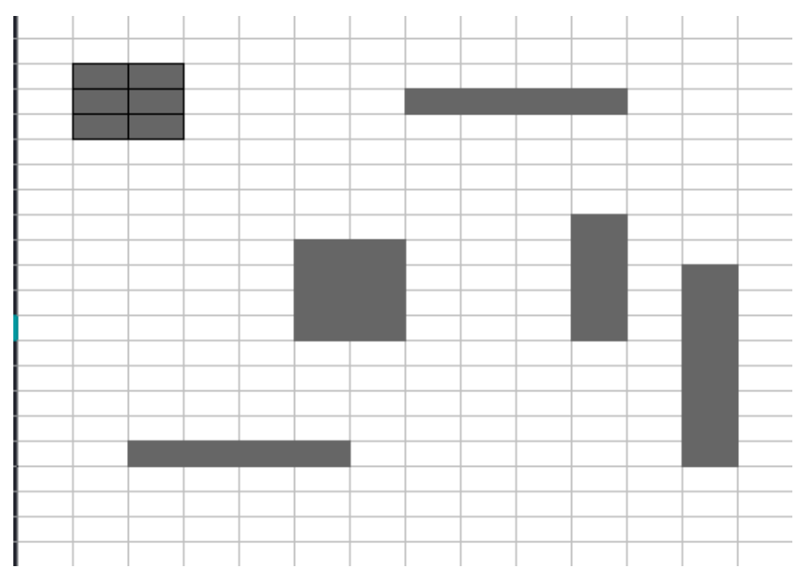

# Introducción a la Inteligencia Artificial: Introspección - Islas

El problema que se presenta a continuación es observar la imagen y analizar cuantas islas contiene.

Lo primero entonces es definir que se considera una isla, para ello hay que tener claro que los cuadros blancos son casillas libres o de mar, por lo que estas son las que indican la separación entre las islas. Entonces, las casillas grises son las consideradas casillas de tierra, de manera que mientras haya una casilla gris quiere decir que ahí hay una isla. Además de la distinción de color, si hay un conjunto de casillas grises, esta se considerara una sola isla. Para que estas estén en un mismo conjunto, deben tocar otra casilla gris por cualquiera de los lados, es decir, arriba, abajo, izquierda o derecha. Por lo que, si hay una casilla gris en diagonal con otra, se cuentan como islas separadas.

El segundo punto importante para analizar entonces es el método por el cuál se va a realizar el conteo de las islas. A simple vista pareciera que solo es cuestión de contar los conjuntos de bloques grises y ya.  Sobre todo, porque en el ejemplo anterior se puede ver a simple vista que son 6 islas. Sin embargo, en una situación en el que el tamaño del mapa sea mucho más grande, y existan muchas más islas, este método resultará ineficiente por distintos motivos.

El primero motivo de ineficiencia es que se pueden generar confusiones y errores al contar, pues si las formas y tamaños de las islas son tan diversos y extensos, es muy probable que en más de una ocasión ocurra una confusión, lo que genere errores en el conteo y que se cuenten islas por duplicado.

Una alteración a este algoritmo de búsqueda desordenada es dejar una marca en las islas ya contadas, sin embargo, esto no soluciona el segundo problema de este método de búsqueda, que es la ineficiencia para encontrar todas las islas. Llegado a un punto en el que se tienen muchas islas marcadas, encontrar las pocas que no lo estén, será igual de complejo que encontrar a Wally en estos libros de buscar dibujos específicos. Lo que puede resultar en que la solución tarde mucho tiempo en darse, o que no se encuentren todas las islas y por ende se cuenten islas de menos.

Es claro entonces, que hacer la búsqueda de las islas sin un algoritmo ordenado no resultara para los casos más complejos. Entonces se propone la solución de recorrer toda la imagen, de manera ordenada. Para ello se propone el siguiente algoritmo de conteo de islas. Comenzar por el extremo superior izquierdo recorriendo todo el mapa. Si es una casilla blanca, continuar con la casilla siguiente. Si es una casilla gris, verificar que la casilla anterior horizontal no sea gris, y verificar que la casilla de arriba no sea gris.  Si ninguna de las dos casillas es gris, se incrementa el contador de islas y continua con la siguiente casilla. Si alguna de las casillas es gris, simplemente se pasa a analizar la siguiente casilla.

Este algoritmo permite realizar un conteo de las islas de manera ordenada, en mapas pequeños puede que tarde más que una búsqueda aleatoria, pero en mapas más grandes será mucho más eficiente, pues recorrerá todo el mapa en vez de hacer saltos entre puntos aleatorios del mismo. Pareciera que es el algoritmo perfecto para solucionar este problema, pero tiene un problema de lógica. ¿Qué pasa si una isla tiene forma de “L” invertida? En este caso el algoritmo contaría dos veces una misma isla, pues al llegar a la parte de arriba de la L vería que no tiene casillas grises ni a la izquierda, ni encima, contaría una isla. Posteriormente al repasar los niveles superiores ignoraría las casillas grises, pues tienen una casilla gris encima. Pero al llegar a la base, la punta izquierda de la base también cumple con las características de no tener una casilla gris encima, ni a la izquierda.

Para solucionar este problema se pueden hacer diversos ajustes al algoritmo, uno de los más eficientes es verificar si la casilla actual tiene una casilla gris delante, en caso de que si, verificar que dicha casilla gris no tenga una casilla gris encima, ni a la derecha. Si tiene una casilla gris encima, no se cuenta, y se avanza a la siguiente casilla. En caso de tener una casilla gris a la derecha se verifica que dicha casilla no tenca casillas encima, ni a la derecha. Hacer esas comprobaciones adelantadas puede ser complejo, por lo que el algoritmo puede ser simplificado.

La simplificación que se puede hacer es entonces que el algoritmo verifique si tiene una casilla gris, a la izquierda, arriba, o a la derecha. Si hay una casilla arriba no se cuenta y se continua, si hay una casilla a la izquierda, y no hay ninguna a la derecha, se incrementa el contador de islas, y si hay una casilla gris adelante, se avanza. El problema ahora es que, si se encuentra una isla con forma de C, esta se contará dos veces, pues cada extremo de la C cumple con las características de conteo.

Mientras que las islas cuenten con formas más regulares, es decir, solo sean líneas y rectángulos, los algoritmos ordenados funcionan correctamente, pero al someterlos a situaciones donde las islas pueden tener formas bastante irregulares, es cuando estos algoritmos tienen errores de calculo y conteo. Para evitar estos errores es necesario reajustar el algoritmo y agregar un método para que el algoritmo reconozca que ciertas casillas ya fueron contadas.
Considerando dichas necesidades se propone un ajuste para el segundo algoritmo ordenado, que deje algunas marcas que sirvan de retro alimentación al mismo algoritmo para conocer si una casilla ya fue revisada y si esta pertenece a una nueva isla o a una previamente contada.

El algoritmo con los ajustes queda en un principio muy similar a la segunda versión del algoritmo de revisión ordenada. Se hacen verificaciones si la casilla de arriba es gris, la de la izquierda, y la de la derecha. Si la casilla de arriba es gris, la casilla actual se marca como contada y se continua con la siguiente casilla a la derecha. Si no hay casilla gris arriba, se verifica, si hay una casilla gris a la izquierda. En caso de que, si haya una casilla gris a la izquierda, se verifica que esta no está marcada como contada, si esta marcada como contada, la casilla actual se marca como contada y se avanza a la siguiente casilla. En caso de que no tenga marca como contada, se verifica que no haya una casilla gris a la derecha, si hay una casilla gris a la derecha, se avanza a dicha casilla. En caso de que no haya una casilla gris a la derecha, se cuenta la isla.

Con este algoritmo se puede recorrer todo el mapa de manera iterativa, para realizar el conteo de las islas, pero que pasaría si quisiéramos resolver un problema muy similar, pero ahora contando los elementos que son del mismo color. Es posible utilizar el mismo algoritmo mencionado anteriormente, pero con la diferencia de que ahora en vez de verificar que el color de la casilla sea gris, verifiquen que su color propio es igual al de las casillas con las que comparan. Con los ajustes de los colores el algoritmo queda de la siguiente manera.

Se analiza el color actual, y se compara con las casillas de arriba, la izquierda y la derecha. Si la casilla de arriba es del mismo color que la casilla actual, entonces se marca como contada y se avanza a la siguiente casilla. Se compara con la casilla de la izquierda, si esta es del mismo color, se verifica si esta esta marcada como contada. Si está marcada como contada, la casilla actual se marca como contada y se avanza a la siguiente casilla. Si la casilla de la izquierda no es del mismo color, o no esta marcada como contada, se compara con la casilla de la derecha. Si la casilla de la derecha es del mismo color se avanza a dicha casilla. Si no son del mismo color, se incrementa el contador referente al color de la isla y se avanza a la siguiente casilla.
