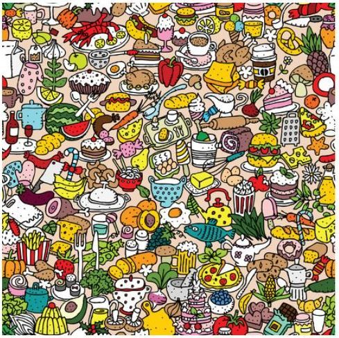

# Indtroducción a la Inteligencia Artificial: Introspección

Solucionar un problema conlleva múltiples pasos ordenados en la secuencia correcta, de manera que se haga un procesado de objetos, datos, materia, etc. Que al pasar por cada uno de los pasos de la solución se transforme en un producto ya sea de la misma índole, o algo completamente distinto. El resultado depende no solo del estado en el que entra el objeto, sino de todo el procesamiento que se le realiza una vez está dentro del sistema. Por lo que distintos objetos pueden desencadenar múltiples respuestas en el mismo sistema. Para nosotros los humanos es habitual resolver múltiples problemas de distinta temática y nivel de complejidad. Consiente e inconscientemente somos capaces de evaluar las distintas características de un problema dado y generar soluciones a partir de ellas.

El problema a continuación se centra en encontrar cuantos objetos hay de color rojo en la siguiente imagen:

A simple vista se puede considerar un problema extremadamente simple, pues si queremos conocer cuántos objetos son del color rojo nuestra respuesta como humanos es sencillamente empezar a contar los objetos rojos que percibimos. Sin embargo, se están ignorando muchos de los procesos que hay que realizar para hacer dicho conteo y de las abstracciones y cuestiones filosóficas que nosotros como humanos damos por hecho.

Un ejemplo sencillo de las abstracciones más importantes a tomar en cuenta se responde con la pregunta ¿Qué es el color rojo? Al querer responder esta pregunta es natural intentar hacerlo referenciando objetos de dicho color “El rojo es el color de las manzanas y las cerezas”, sin embargo, esta respuesta requiere un nivel de comprensión abstracta del mismo nivel o superior.

Otro tipo de abstracciones que se ignoran es la delimitación de los colores, ¿Hasta qué punto deja de ser considerado rojo y se le empieza a llamar naranja o purpura? A simple vista parece una pregunta muy compleja, si bien, hoy en día existen métodos para distinguir de manera más precisa los colores, como con los formatos RGB o CMYK, ningún humano en condiciones naturales ve un color y piensa 25 rojo, 30 verde y 19 azul.  Se podría decir que los humanos lo perciben el color de manera absoluta. Mientras que una computadora tendría que parametrizar valores RGB para definir si el color es considerable rojo o no, el humano se salta ese proceso y define el color rojo de manera instintiva, lo que puede llevar a algunos errores de percepción durante la clasificación. Por así decirlo, el humano ve el dibujo y piensa, “Esto parece más naranja que rojo, no es un objeto rojo”.

Después de definir que se puede considerar rojo, se procede a analizar la imagen para encontrar los objetos que cumplan con la característica de ser de dicho color. Para realizar esta tarea se realizan múltiples subtareas bastante complejas que pasan desapercibidas. Lo primero de estas subtareas, distinguir un objeto de otro, un ejemplo de ello es que, si hay un círculo pegado a un cuadrado, nuestro cerebro no los percibe como un solo objeto, sino que de manera instintiva los considera como dos objetos distintos. Pareciera un ejemplo muy simple, pero analizando figuras u objetos con composiciones más complejas, el cerebro presenta una eficiencia similar para distinguir los distintos cuerpos presentes, hay excepciones donde se encuentra la manera de engañar al cerebro y confundirlo para que perciba más o menos objetos presentes, pero en la mayoría de los casos es capaz de realizar las distinciones sin mucha dificultad. Pero ¿Cómo hace el cerebro para lograr esas distinciones?

Existen muchas formas en las que el cerebro distingue la diferencia entre un objeto y otro únicamente utilizando la vista. Ya sea por las diferencias de color entre objetos, diferencias en algunos rasgos o una separación marcada. En el caso del análisis del dibujo el cerebro humano emplea la distinción por colores y por separaciones marcadas. Siendo más precisos, los objetos en la imagen del ejercicio están contenidos por trazos de color negro, además de que dentro de los límites marcados por el color negro hay un color sólido. De manera es fácil distinguir hasta a los objetos que comparten color.

Hasta ahora ya está definido el parámetro principal que es ¿Qué es el color Rojo?, y ya se tiene claro como distinguir entre distintos objetos, están contenidos por un contorno negro y dentro de ese contorno solo hay un color sólido. Por lo que la siguiente subtarea para definir cuantos objetos rojos hay en la imagen es encontrar dichos objetos rojos. Para ello se pueden realizar distintos métodos de búsqueda, recorrer por renglones de izquierda a derecha, recorrer por columnas de arriba abajo, de manera aleatoria, etc., pero independientemente del método seleccionado es necesario un método para distinguir que un objeto ya fue contado o usar un algoritmo de búsqueda en el que no sea posible que se repita la presencia de un objeto.

Debido a que los objetos presentes en la imagen son de múltiples tamaños y formas, es complicado utilizar un algoritmo en el que no se pase por un mismo objeto más de una vez. Por lo que se optará por marcar los objetos ya visitados, de manera que, aunque se pase por un objeto rojo múltiples veces, solo se cuente una vez. Para agilizar el proceso de conteo, la marca que se utiliza para distinguir el que ya se registró un objeto, será el número de dicho objeto en la cuenta. Por ejemplo, el primero objeto encontrado llevará la marca “1”, el siguiente objeto la marca “2” y así sucesivamente.

En este caso el recorrido se realizó de derecha a izquierda y una vez llegando al borde de la imagen se pasa a la fila inferior recorriendo ahora de izquierda a derecha, al llegar al otro extremo, se pasa de nuevo a la tupla inferior y se vuelve a recorrer de izquierda a derecha, repitiendo esto hasta que ya no sea posible bajar más en la imagen. La altura de cada fila es de aproximadamente 2 centímetros, sin embargo, es bastante probable que ocurran errores en el cálculo de dicha altura, por lo que al momento de revisar las filas es muy probable que las filas revisadas tengan diferentes tamaños, o que una misma fila.

En general, a lo largo de toda esta solución es muy probable que se cometan errores por fallas en el cálculo, sesgos de interpretación o ineficiencias presentadas por el humano que realice dicho ejercicio. Dependiendo cuando se origine el error será el impacto en el resultado final. Por ejemplo, si se define incorrectamente el color rojo, se van a contar todos los objetos de ese color definido, más no será el rojo. Por lo que es necesario considerar que habrá una cantidad considerable de inexactitud en la solución.

Para mejorar el nivel de precisión de la respuesta y tener una mayor certeza es posible realizar el procedimiento varias veces y comparar los distintos resultados para verificar si hay alguna diferencia entre las iteraciones de la solución. Por lo que obtener una solución confiable al problema de saber cuántos objetos rojos en la imagen, se vuelve un proceso muy ineficiente.

Si resolvemos este problema utilizando un computador se eliminan algunos errores, sobre todo los errores respecto al conteo y calculo, sin embargo, se incrementa la complejidad en la definición de los aspectos más abstractos y subjetivos. Para eliminar sesgos y parametrizar estos aspectos se pueden utilizar múltiples herramientas y librerías de análisis de imágenes que ya resuelven la parametrización de estos aspectos más abstractos, lo que simplifica mucho el proceso de búsqueda de las figuras.

Pareciera que es muy simple el proceso de encontrar las figuras en una imagen por computador, pero hay que recordar que las librerías y las herramientas hacen que la parte más complicada de este proceso de parametrizar una abstracción. De no ser por dichas herramientas, se tendría que hacer el procesado de toda la imagen, aclarar cual será el color que se va a buscar de y aclarar como se distingue un objeto de otro de manera manual. Con el uso de librerías esto se hace con un par de comandos, sin ellas se requieren muchas líneas de código.

Es muy interesante el contraste entre la perspectiva de la computadora y la perspectiva del humano para resolver este problema, en el caso de la computadora la parte sencilla es el calculo y el análisis aritmético y el aspecto de mayor complejidad es pasar variables abstractas a valores parametrizables. Mientras que, con el humano, la tarea más sencilla es la definición de los conceptos abstractos, pero con altas probabilidades de error en la parte aritmética.

Como se puede observar, lo que al principio parecía una tarea sumamente sencilla, observar una imagen y contar los objetos de un mismo color, cuando se analiza en profundidad, se aprecian todos los pequeños detalles importantes que hacen de una tarea “simple”, una tarea con múltiples pasos, cálculos y subtareas.
