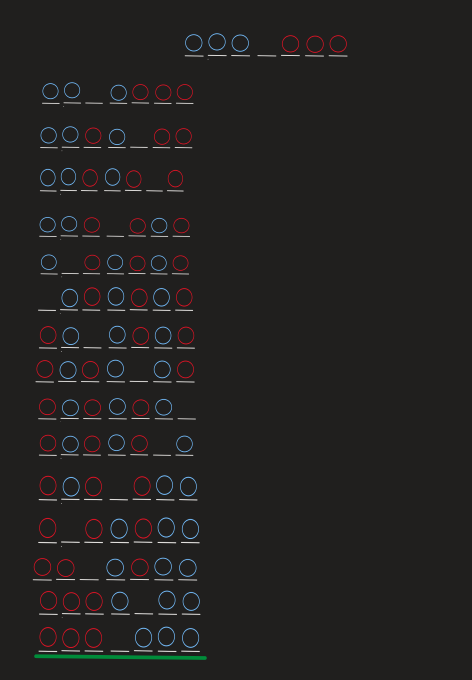

# 8.- Reglas y Búsqedas: Espacio de Estados

## Saltos Ranas

Se tienen 6 ranas en total en un tablero de 7 huecos, hay 3 ranas de cada lado, el objetivo es llevar todas las ranas del lado derecho al lado izquierdo.

### Secuencia de Percepción 1

- Las ranas deben estar al otro lado de donde comenzaron
- Los saltos deben ser por turnos es decir primero un color y luego el otro
- Solo se puede saltar a casillas libres
- Solo se puede saltar un espacio a la vez
- Se puede saltar más de una casilla si y solo si, la siguiente casilla está ocupada pero la siguiente de ella está libre
- Las ranas no pueden saltar hacia el lado contrario al que deben cruzar.

### Medidas de Rendimiento 1

-Número de Saltos utilizados
-Todas las ranas llegan al otro lado

### Espacio de Estados

En el espacio de estados se puede observar que con la secuencia de percepción solo se llega a estados terminales, pero ninguno es el estado deseado.

### Secuencia de Percepción 2

- Las ranas deben estar al otro lado de donde comenzaron
- Los saltos pueden realizarse en cualquier orden sin importar el color
- Solo se puede saltar a casillas libres
- Solo se puede saltar un espacio a la vez
- Se puede saltar más de una casilla si y solo si, la siguiente casilla está ocupada pero la siguiente de ella está libre
- Las ranas no pueden saltar hacia el lado contrario al que deben cruzar.

### Medidas de Rendimiento 2

- Número de Saltos utilizados
- Todas las ranas llegan al otro lado

### Espacio de Estados 2

## Cruzar el Río

### El Granjero

Un granjero, una gallina, una lechuga y un coyote estan a la orilla de un río. El granjero debe llegar al otro lado con los otros objetos. Con la limitante de que el en la balsa solo cabe el granjero y que el coyote se comerá la gallina si se queda solo con ella, así como la gallina se comerá al coyote se comerá la lechuga si se queda sola con ella.

#### Secuencia de Percepción

- Solo el granjero puede manejar la balsa
- En la balsa solo caben el granjero y un objeto
- Cualquiera de los tres objetos puede permanecer solo
- La gallina no puede quedarse sola con la lechuga
- El coyote no puede quedarse solo con la gallina
- Buscar realizarlo en el menor número de movimientos posible

#### Medidas de Rendimiento

- El granjeo ha cruzado el río con el pollo, la lechuga y el coyote
- El granjero ha cruzado en el menor número de movimientos posible

### Los Monjes

Un grupo de 3 monjes y 3 canibales están a la orilla de un río, los 6 individuos deben cruzar, pero en el momento en el en algún lado haya un mayor número de canibales que monjes, los canibales atacarán a los monjes.

#### Secuencia de  Percepción

- Solo caben dos individuos en la balsa, no importa si son canibales o monjes
- Cualquiera puede manejar la balsa
- Siempre que haya al menos 1 en una isla, monje el número de monjes en la isla debe que ser mayor o igual al número de canibales que hay en esa isla
- Buscar realizarlo en el menor número de movimientos posible

#### Medidas de  Rendimiento

- Todos los monjes y canibales han cruzado el río
- Los monjes y los canibales cruzaron el río haciendo el menor número de movimientos posibles
