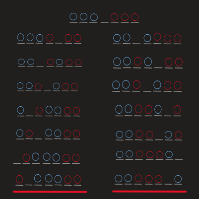
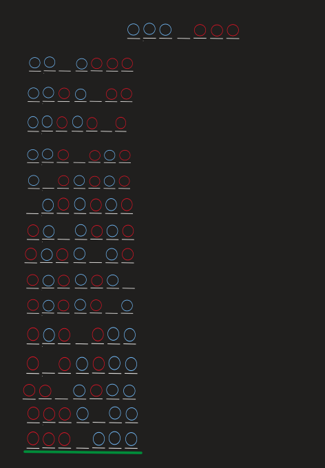

# Saltos Ranas

Se tienen 6 ranas en total en un tablero de 7 huecos, hay 3 ranas de cada lado, el objetivo es llevar todas las ranas del lado derecho al lado izquierdo.

## Secuencia de Percepción 1

- Las ranas deben estar al otro lado de donde comenzaron
- Los saltos deben ser por turnos es decir primero un color y luego el otro
- Solo se puede saltar a casillas libres
- Solo se puede saltar un espacio a la vez
- Se puede saltar más de una casilla si y solo si, la siguiente casilla está ocupada pero la siguiente de ella está libre
- Las ranas no pueden saltar hacia el lado contrario al que deben cruzar.

## Medidas de Rendimiento 1

-Número de Saltos utilizados
-Todas las ranas llegan al otro lado

## Espacio de Estados

En el espacio de estados se puede observar que con la secuencia de percepción solo se llega a estados terminales, pero ninguno es el estado deseado.

## Secuencia de Percepción 2

- Las ranas deben estar al otro lado de donde comenzaron
- Los saltos pueden realizarse en cualquier orden sin importar el color
- Solo se puede saltar a casillas libres
- Solo se puede saltar un espacio a la vez
- Se puede saltar más de una casilla si y solo si, la siguiente casilla está ocupada pero la siguiente de ella está libre
- Las ranas no pueden saltar hacia el lado contrario al que deben cruzar.

## Medidas de Rendimiento 2

- Número de Saltos utilizados
- Todas las ranas llegan al otro lado

## Espacio de Estados 2

